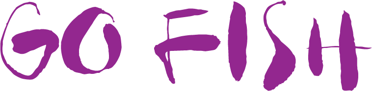
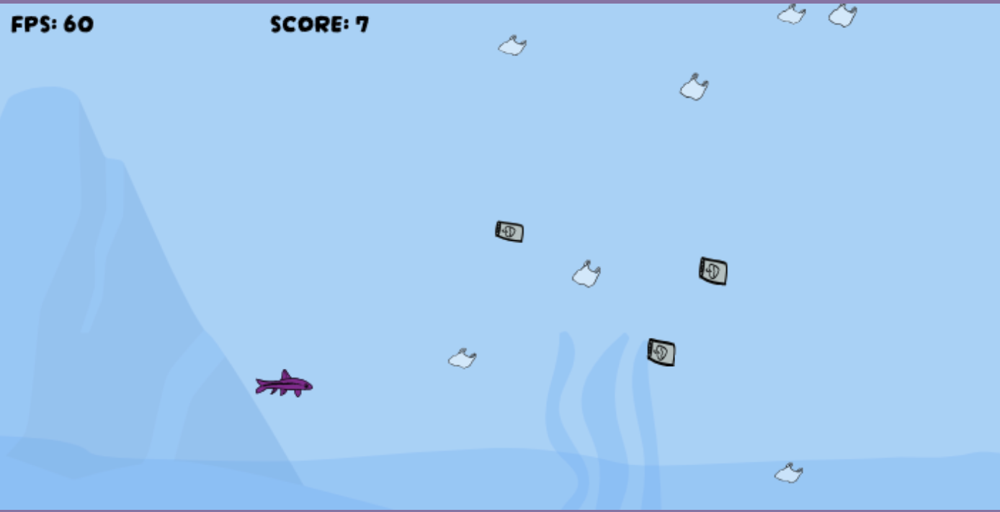

---

 
 

> Go fish Go! oh! oh! oh!

 
 

 
 

# **Index**

---

1. [Game Preview](#game-preview)
2. [About the Game](#✦-about)
3. [Motivation](#✦-motivation)
4. [Dependencies](#✦-dependencies)
5. [Thanks](#✦-thanks)

 
 

## **Game Preview**

---

 
 

## **About the Game**

---

You are a small fish trying to escape all the garbage that is thrown into the ocean everyday. Be careful, not to hit any piece of garbage, or you'll die.
 

### **Controls:**

 

| Keyboard   | Action  |
| ---------- | ------- |
| Up Arrow   | Go Up   |
| Down Arrow | Go Down |

 
 

## **Motivation**

---

I've built the game as a project for Core Code School. My son Eneko. He wants to be a Marine Bioligist so he wanted to make a "fish escape" game.

After going around varients, like flappy bird, or Space Invaders, I decided to make the fish escape from the sea polluted with garbage.

I've designed the whole game: background, the fish, the garbage.. ,
 
 

## **Dependencies**

---

Project dependencies:

- [Node](https://nodejs.org)
- [Yarn](https://yarnpkg.com)
- [Typescript](https://www.typescriptlang.org/)
- [Sweetalert2](https://sweetalert2.github.io)
- [Vite](https://vitejs.dev/)

 
 

## **Thanks**

---

I would like to thank our teacher [Juan Pablo Mora Serrano](https://github.com/Systrent) and [Core Code School](https://www.corecode.school/r), for all the help provided during these classes weeks and for being available to answer any questions. Nor would it have been possible without the support of my colleagues Junior and Daniel.

 
 
